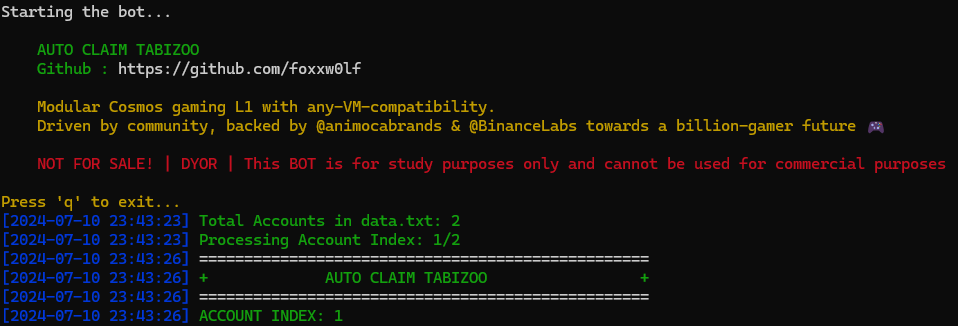
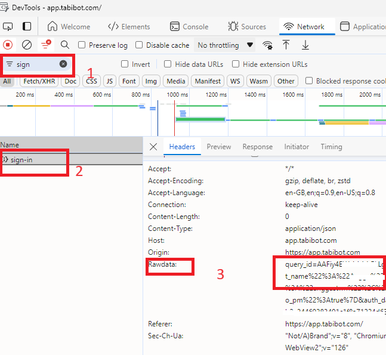

#TABIZOO
Auto Claim TABIZOO

<center>

</center>

# Table of Contents
- [TABIZOO BOT](#TABIZOO)
- [Table of Contents](#table-of-contents)
- [Feature](#feature)
- [Registration](#registration)
- [How to Use](#how-to-use)
  - [Windows](#windows)
- [How to Get Data](#how-to-get-data)

# Feature

- ✅ Auto Claim TABI
- ✅ Auto CheckIn Daily TABI
- ✅ Multi Account TABI

# Registration

Start bot : [HERE](https://t.me/tabizoobot/tabizoo?startapp=brK5j)

# How to Use

## Windows 

1. Make sure you computer was installed python and git.
   
   python site : [https://python.org](https://python.org)
   
   git site : [https://git-scm.com/](https://git-scm.com/)

2. Clone this repository
   ```shell
   git clone git clone https://github.com/foxxw0lf/TabiZooBot.git
   ```

3. goto TabiZooBot directory
   ```
   cd TabiZooBot
   ```

4. install the require library
   ```
   INSTALL.bat
   ```

5. fill the `data.txt` file with your data, how to get data you can refer to [How to Get Data](#how-to-get-data)
6. execute the main program 
   ```
   START.bat
   ```
# How to Get Data
   
   1. Active web inspecting in telegram app ex. TABIZOO
   2. Goto TABIZOO bot and open the apps
   3. Press `F12` on your keyboard to open devtool and go to `Network` then filter `Sign-in` after that copy `rawdata`

<center>

</center>
    
